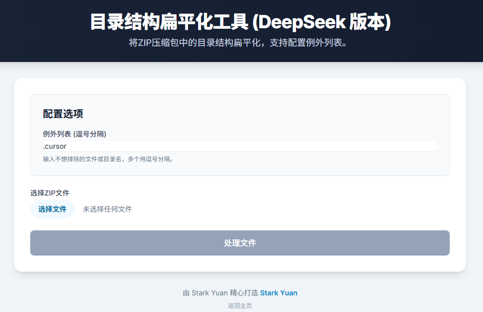

  
  <h1 align="center">BeavFlatten (狸壓俠)</h1>
  

    <i>"像河狸築壩一樣，我們'壓'平你的壓縮檔。"</i>
     
    <a href="https://yuanyuanyuan.github.io/BeavFlatten_tool/"><strong>體驗工具 »</strong></a>
     
     
    <a href="README.md">English</a> | <a href="README.zh-CN.md">简体中文</a> | <a href="README.zh-TW.md">繁體中文</a>
  

---

## 關於專案

**BeavFlatten (狸壓俠)** 是一個強大的、完全在瀏覽器端運行的網頁工具，旨在即時"壓"平 ZIP 壓縮檔中複雜的目錄結構。您是否曾從 GitHub 下載專案後，陷入無休止的巢狀資料夾中？BeavFlatten 透過提取所有檔案、將它們移動到單個頂級目錄，並根據其原始路徑智慧重命名，完美解決了這個問題。

它快速、安全，並且極其易用。

### 技術棧

*   **HTML5, CSS3, JavaScript (ES6+)**
*   **Tailwind CSS**: 用於構建現代化的響應式介面。
*   **JSZip.js**: 用於在客戶端處理 ZIP 檔案。
*   **FileSaver.js**: 用於在瀏覽器中觸發檔案下載。

## 主要特性

✨ **純客戶端運行**: 無需上傳檔案。您的資料 100% 安全私密，只留在您的瀏覽器中。
🗂️ **目錄扁平化**: 智慧地將 `path/to/your/file.txt` 轉換為 `path--to--your--file.txt`。
🧠 **智慧排除**: 自動忽略 `.git` 資料夾、`.DS_Store` 檔案等常見冗餘內容。
🔧 **可配置例外**: 您可以完全控制，指定不應被排除的檔案或資料夾。
🌍 **多語言支援**: 完整的用戶介面，支援英語、簡體中文和繁體中文。
🚀 **雙版本，單目標**: 透過 **DeepSeek** 和 **GeminiPro** 兩個版本，探索不同的用戶體驗。

## 開始使用

無需安裝！只需訪問我們的官方網站：

**[https://yuanyuanyuan.github.io/BeavFlatten_tool/](https://yuanyuanyuan.github.io/BeavFlatten_tool/)**

### 如何操作

1.  **訪問網站**: 打開上面的連結。
2.  **選擇版本**: 選擇 DeepSeek 或 GeminiPro 版本。
3.  **上傳您的 ZIP**: 將 `.zip` 檔案拖放到上傳區域，或點擊選擇。
4.  **配置 (可選)**: 如果需要，調整例外列表。
5.  **處理**: 點擊"處理"按鈕。
6.  **下載**: 下載您全新的、已扁平化的 `.zip` 檔案！

## 演示

*點擊圖片，立即體驗！*

## 路線圖

- [x] 核心扁平化邏輯
- [x] 多語言支援
- [x] 現代化的響應式介面
- [x] SEO 與 AI 搜尋優化
- [ ] 使用 GitHub Actions 實現自動化部署
- [ ] 更進階的配置選項
- [ ] 支援其他壓縮格式 (如 `.tar.gz`)

查看 [open issues](https://github.com/yuanyuanyuan/BeavFlatten_tool/issues) 獲取完整的功能建議（和已知問題）列表。

## 貢獻

貢獻是開源社群如此迷人的原因——在這裡，我們學習、啟發和創造。我們**非常感謝**您的任何貢獻。

如果您有任何能讓這個專案變得更好的建議，請 fork 本倉庫並創建一個 pull request。您也可以簡單地提交一個帶有 "enhancement" 標籤的 issue。

1.  Fork 本專案
2.  創建您的功能分支 (`git checkout -b feature/AmazingFeature`)
3.  提交您的更改 (`git commit -m 'Add some AmazingFeature'`)
4.  推送到分支 (`git push origin feature/AmazingFeature`)
5.  開啟一個 Pull Request

## 授權條款

根據 MIT 授權條款分發。更多資訊請參見 `LICENSE.txt` 檔案。

## 聯繫方式

Stark Yuan - [yuanyuanyuan (at) example.com](mailto:yuanyuanyuan@example.com)

專案連結: [https://github.com/yuanyuanyuan/BeavFlatten_tool](https://github.com/yuanyuanyuan/BeavFlatten_tool)

## 致謝

*   [JSZip](https://stuk.github.io/jszip/)
*   [FileSaver.js](https://github.com/eligrey/FileSaver.js/)
*   [Tailwind CSS](https://tailwindcss.com/)
*   [Heroicons](https://heroicons.com/)

---

  
由 <a href="https://github.com/yuanyuanyuan">Stark Yuan</a> 用 ❤️ 精心打造

 